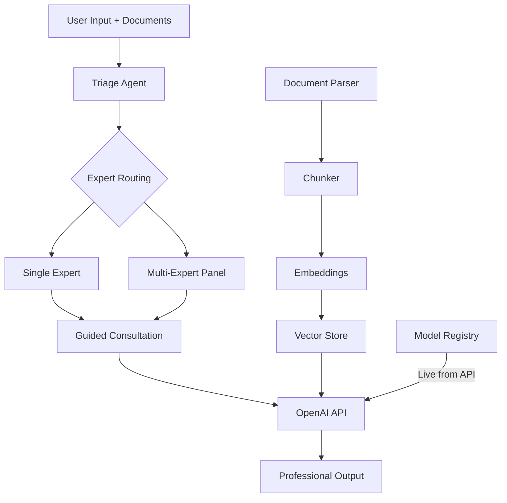

# askapro-cli

**Ask a Pro — AI-powered document analysis with 85+ expert consultation roles.**

Predefined specialist roles — from attorneys and doctors to tax advisors and architects. Reads documents of any format, automatically activates the right expert, and produces professional outputs like lawsuits, tax returns, or expert opinions.

**Free and open source.** Just connect with your OpenAI account.

---

## Features

- **85+ Expert Roles** — Legal, Tax & Finance, Medical, Real Estate, Insurance, Business, Academia, Engineering, Consumer — plus 20 Germany-specific legal specialists
- **Automatic Expert Routing** — Detects which specialist is needed based on your documents and questions
- **Guided Consultation** — Walks you through the process step-by-step with multiple-choice questions, follow-ups, and confirmations before producing outputs
- **Country-Aware** — Generic roles ask for your jurisdiction first, then research the applicable laws
- **Dynamic Model Selection** — Fetches available models live from the OpenAI API; default: newest flagship model (currently GPT-5.4)
- **All Document Formats** — PDF, DOCX, XLSX, CSV, PowerPoint, Pages, Numbers, Keynote, HTML, Emails, Images (OCR), Archives
- **Professional Outputs** — Lawsuits, objections, tax returns, expert opinions, official letters
- **Multi-Expert Panel** — Multiple experts simultaneously for complex cases (e.g., divorce: family law + tax + real estate)
- **RAG Pipeline** — Semantic search across document collections via embeddings
- **Configurable** — Global and project-specific OPENAI.md configuration files
- **Pipe-friendly** — Non-interactive mode for scripting

## Installation

### Homebrew (recommended, macOS)

```bash
brew tap marcelrgberger/tap
brew install askapro-cli
```

### npm

```bash
npm install -g askapro-cli
```

### From Source

```bash
git clone https://github.com/marcelrgberger/askapro-cli.git
cd askapro-cli
npm install
npm run build
npm link
```

## Setup

You need an OpenAI API key. Get one at [platform.openai.com](https://platform.openai.com/api-keys).

```bash
# Option 1: Environment variable
export OPENAI_API_KEY="sk-..."

# Option 2: Pass at startup
askapro --api-key "sk-..."

# Option 3: Saved automatically after first use
```

On first launch, you'll be prompted to choose your preferred model from a live list fetched from the OpenAI API.

## Usage

### Interactive Mode

```bash
askapro
```

```
  askapro — Ask a Pro. Expert Document Agent.
  85+ Expert Roles | Document Analysis | Professional Outputs

  Welcome! Fetching available models from OpenAI...

  1. GPT-5.4 [flagship] [default]
  2. GPT-5.4 Pro [pro]
  3. GPT-5.4 Mini [fast]
  4. GPT-5.4 Nano [nano]
  5. o4-mini [reasoning]
  ...

askapro > I received a termination letter from my employer

  In which country are you located / which law applies?
  1. Germany
  2. Austria
  3. Switzerland
  4. Other (please specify)

askapro > 1

  [Employment Law Attorney (Germany) activated]

  To properly assess your situation, I need some details:

  What type of termination is this?
  1. Ordinary termination by employer
  2. Extraordinary (immediate) termination
  3. Change of terms notice
  4. Mutual termination agreement

  ...
```

### Non-Interactive Mode

```bash
# Analyze a single document
askapro --print "Summarize this document" < contract.pdf

# Analyze a directory
askapro --dir ./tax-receipts/ --print "Prepare a tax return from these receipts"

# Use a specific role
askapro --role steuerberater --print "Check this tax assessment"

# Use a specific model
askapro --model gpt-5.4-pro --print "Complex legal analysis"
```

### Commands

| Command | Function |
|---|---|
| `/help` | Show help |
| `/roles` | List all 85+ expert roles |
| `/role <id>` | Activate a specific role (e.g., `/role steuerberater`) |
| `/role` | Enable automatic routing |
| `/model <name>` | Switch model (fetches live from API) |
| `/model` | Show all available models grouped by tier |
| `/clear` | Clear conversation |
| `/exit` | Exit |

### CLI Arguments

| Argument | Description |
|---|---|
| `--model, -m` | Model to use (default: gpt-5.4) |
| `--role, -r` | Activate specific expert role |
| `--dir, -d` | Directory of documents to ingest on startup |
| `--print, -p` | Non-interactive mode: process query, print result, exit |
| `--api-key` | OpenAI API key |
| `--verbose, -v` | Debug output |

## Expert Roles

### Legal — General (15 Roles)
Employment Law, Family Law, Tenant Law, Traffic Law, Inheritance Law, Criminal Law, Medical Law, Social Law, Administrative Law, IT Law, Corporate Law, Insolvency Law, Construction Law, Insurance Law, Tax Law

### Legal — Germany-Specific (20 Roles)
All official Fachanwalt specializations under the German Fachanwaltsordnung (FAO) plus additional German-specific roles:

Migration Law, Transport & Freight Law, Copyright & Media Law, Banking & Capital Markets Law, Agricultural Law, Public Procurement Law, Intellectual Property Law, International Business Law, Notary (Beurkundungsrecht), Works Council Advisor, Victim's Attorney (Nebenklage), GDPR/Data Protection Attorney, Sports Law, Antitrust/Competition Law, Energy Law, Certified Mediator, Military/Soldiers' Law, Church/Religious Labor Law, Weapons & Hunting Law, Animal Law

### Tax & Finance (8 Roles)
Tax Advisor, Financial Advisor, Auditor, Accountant, Payroll Specialist, Controller, Grants Advisor, Customs Advisor

### Medical & Health (10 Roles)
General Medicine, Cardiology, Orthopedics, Neurology, Dermatology, Dentistry, Psychology, Pharmacy, Nutrition, Medical Coding

### Real Estate & Construction (6 Roles)
Architect, Property Valuator, Real Estate Agent, Structural Engineer, Energy Consultant, Property Manager

### Insurance & Retirement (4 Roles)
Insurance Advisor, Pension Advisor, Disability Insurance Advisor, Health Insurance Advisor

### Business & Startups (6 Roles)
Management Consultant, Startup Advisor, HR Advisor, Data Protection Officer, Compliance Officer, Patent Advisor

### Academia & Science (4 Roles)
Scientific Editor, Statistician, Specialist Translator, Educator

### Engineering (4 Roles)
Vehicle Expert, Electrical Engineer, Environmental Expert, IT Expert

### Consumer (5 Roles)
Consumer Protection, Debt Counselor, Travel Rights, Government Services Guide, Mediator

### Meta (3 Roles)
Document Triage (automatic routing), Multi-Expert Panel (coordinated analysis), Quality Assurance (output validation)

## Supported Document Formats

| Category | Formats |
|---|---|
| Text | .txt, .md, .rst, .tex, .rtf |
| Office | .pdf, .docx, .doc, .xlsx, .xls, .csv, .tsv, .pptx, .ppt |
| Apple | .pages, .numbers, .key |
| Web | .html, .htm, .xml, .json, .yaml, .yml |
| Email | .eml, .msg |
| Images (OCR) | .png, .jpg, .jpeg, .tiff, .bmp, .gif, .webp |
| E-Books | .epub |
| Archives | .zip, .tar.gz, .tar (contents extracted recursively) |

## Model Selection

Models are fetched **live from the OpenAI API** — no hardcoded list. On first launch, you choose your preferred model. Change anytime with `/model`.

You can also set a model per project in your `OPENAI.md`:

```markdown
## Model
- model: gpt-5.4-mini
```

## Configuration

### Global: `~/.askapro/OPENAI.md`

```markdown
# OPENAI.md

## Model
- model: gpt-5.4

## Language
- Output language: German

## Preferences
- Always cite legal references
- Highlight deadlines and critical dates
```

### Project: `./OPENAI.md`

```markdown
# OPENAI.md

## Context
Documents for my divorce proceedings.

## Instructions
- Focus: Family law, property division, child custody
- Jointly owned property to consider
- 2 children (ages 8 and 12)

## Model
- model: gpt-5.4-pro
```

## Custom Expert Roles

Place custom roles as `.md` files in `~/.askapro/roles/`:

```markdown
---
id: my-expert
name: My Custom Expert
category: custom
triggers:
  - keyword1
  - keyword2
outputs:
  - output1
---

# My Custom Expert

## Expertise
Description of the expert's knowledge and capabilities...

## Approach
1. Step 1
2. Step 2
```

## Architecture



## Platform

**askapro-cli is currently optimized for macOS.** Apple document formats (.pages, .numbers, .key) use macOS-native tools (`textutil`).

**Contributions for Windows and Linux are very welcome!** If you'd like to port askapro-cli to other platforms, we appreciate pull requests.

## Documentation

- **[User Guide](docs/USER_GUIDE.md)** — Detailed usage instructions, examples, FAQ
- **[Developer Guide](docs/DEVELOPER_GUIDE.md)** — Architecture, Mermaid diagrams, contributing, adding roles/parsers/tools

## Disclaimer

> This software provides AI-assisted analysis and drafts. It does **not** replace professional consultation by licensed lawyers, doctors, tax advisors, or other specialists. All information is provided without warranty. For legally binding actions, always consult a licensed professional.

## License

MIT License — Marcel R. G. Berger

## Contributing

Contributions are welcome! Especially needed:
- New expert roles (especially for non-German jurisdictions)
- Windows/Linux compatibility
- Additional document formats
- Improvements to existing roles
- Tests and CI improvements
