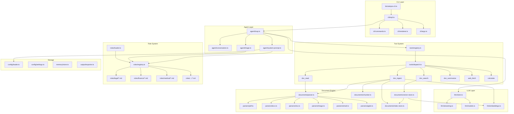
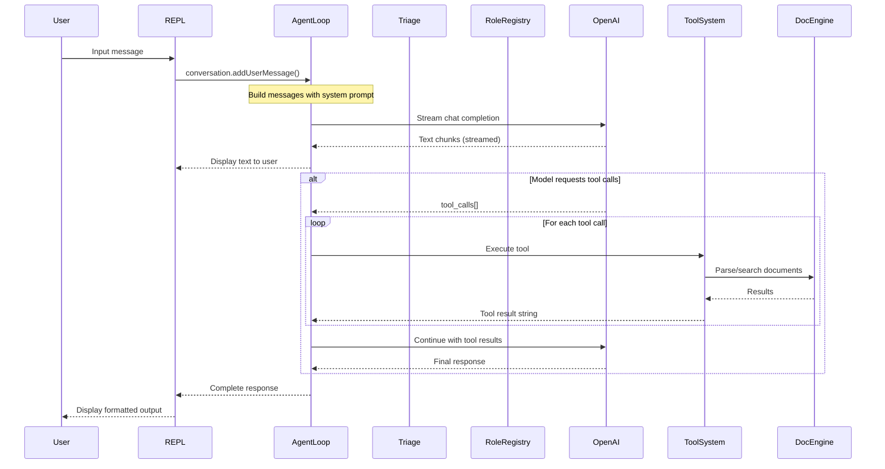
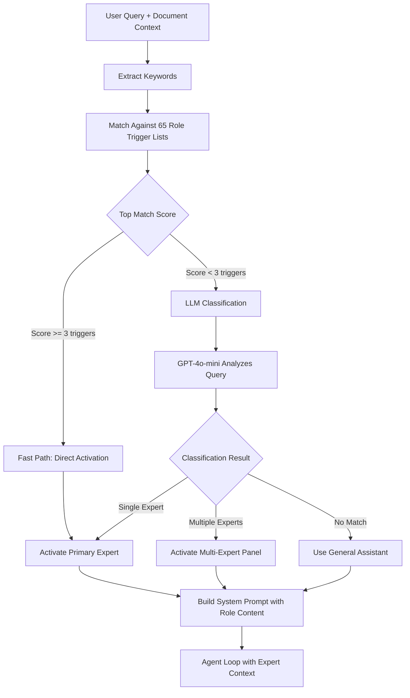
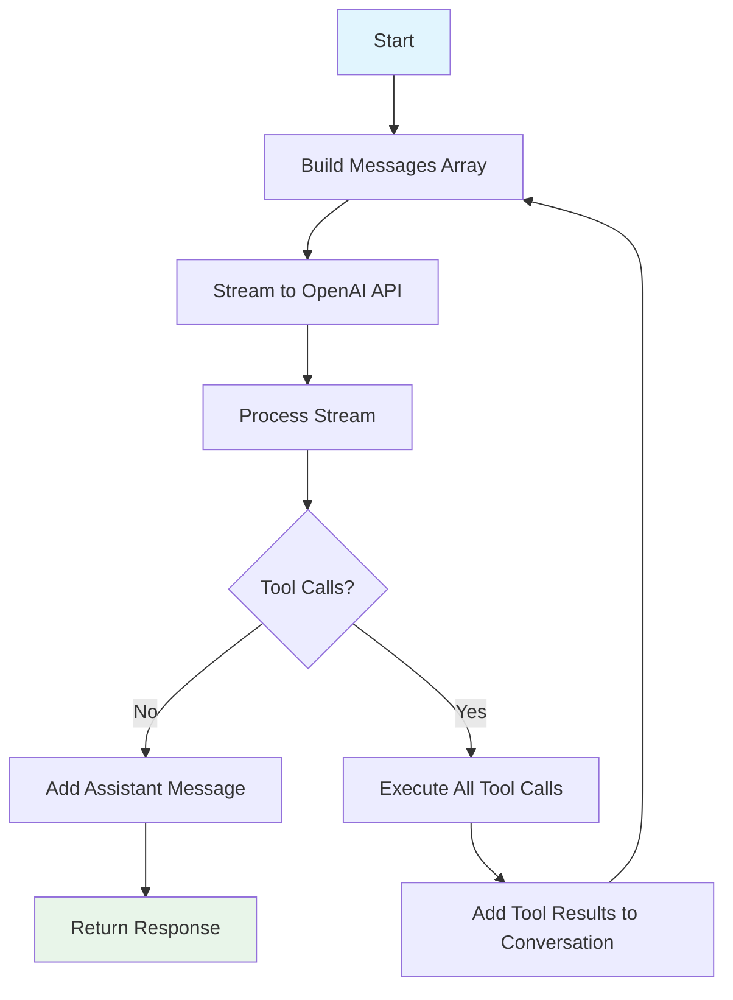
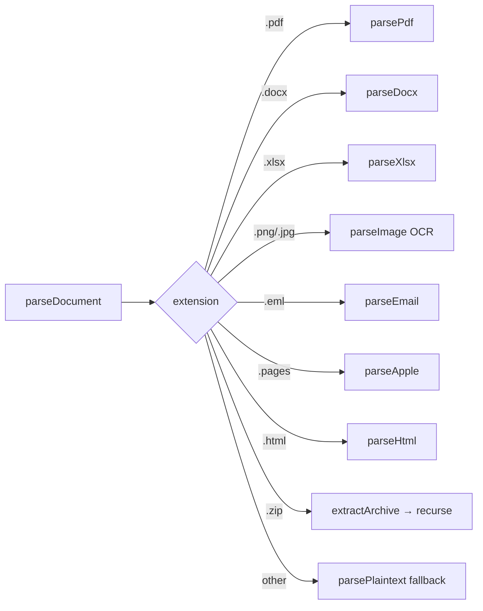
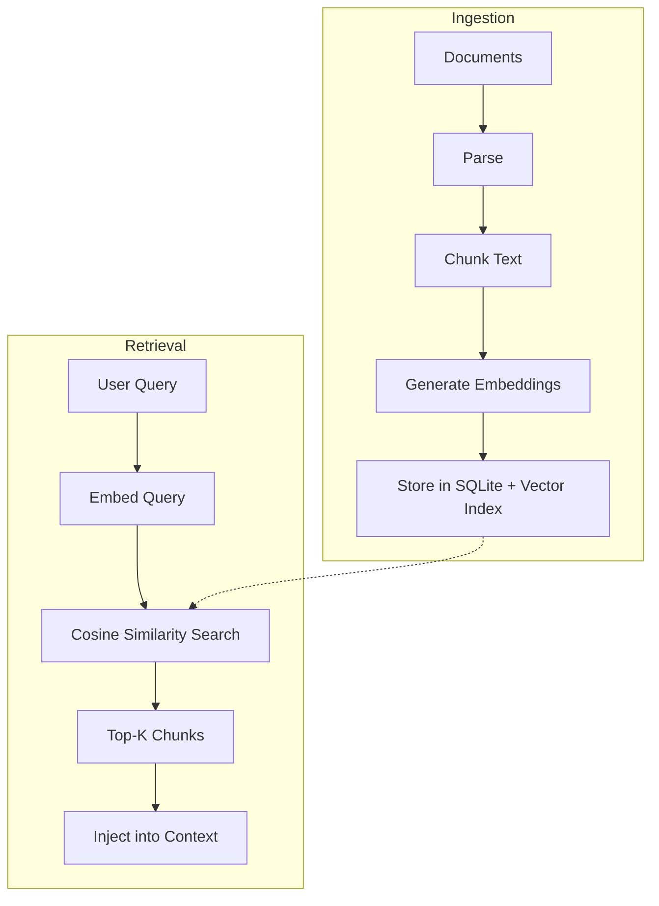
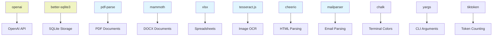

# askpro-cli — Developer Guide

Technical documentation for contributors and developers.

## Table of Contents

- [Architecture](#architecture)
- [Project Structure](#project-structure)
- [Core Components](#core-components)
- [Data Flow](#data-flow)
- [Adding Expert Roles](#adding-expert-roles)
- [Adding Document Parsers](#adding-document-parsers)
- [Adding Tools](#adding-tools)
- [Build & Development](#build--development)
- [Testing](#testing)
- [Homebrew Distribution](#homebrew-distribution)
- [Contributing](#contributing)

---

## Architecture

### High-Level Architecture



### Request Lifecycle



### Triage Decision Flow



## Project Structure

```
askpro-cli/
├── bin/
│   └── askpro-cli.ts           # CLI entry point
├── src/
│   ├── index.ts                # Public API exports
│   ├── cli/
│   │   ├── args.ts             # CLI argument parsing (yargs)
│   │   ├── commands.ts         # Slash command handlers
│   │   ├── renderer.ts         # Terminal rendering (chalk)
│   │   └── repl.ts             # Main REPL loop (readline)
│   ├── agent/
│   │   ├── conversation.ts     # Message history management
│   │   ├── loop.ts             # Core agent loop (stream → tool calls → recurse)
│   │   ├── system-prompt.ts    # System prompt assembly
│   │   └── triage.ts           # Automatic expert routing
│   ├── llm/
│   │   ├── client.ts           # OpenAI API wrapper + streaming
│   │   ├── embeddings.ts       # OpenAI embeddings API
│   │   └── models.ts           # Model registry (GPT-4o, o3, etc.)
│   ├── tools/
│   │   ├── registry.ts         # Tool registration and dispatch
│   │   └── definitions/
│   │       ├── calculate.ts    # Math calculations
│   │       ├── doc-ingest.ts   # Batch document ingestion
│   │       ├── doc-read.ts     # Read single document
│   │       ├── doc-search.ts   # Semantic document search
│   │       ├── doc-summarize.ts # Directory overview
│   │       └── web-fetch.ts    # HTTP fetch
│   ├── documents/
│   │   ├── chunker.ts          # Text chunking with overlap
│   │   ├── index-store.ts      # SQLite chunk storage
│   │   ├── parser.ts           # Unified parser router
│   │   ├── vector-store.ts     # Cosine similarity search
│   │   └── parsers/
│   │       ├── apple.ts        # Pages/Numbers/Keynote (textutil)
│   │       ├── archive.ts      # ZIP/TAR extraction
│   │       ├── docx.ts         # DOCX (mammoth)
│   │       ├── email.ts        # EML/MSG (mailparser)
│   │       ├── html.ts         # HTML (cheerio)
│   │       ├── image.ts        # OCR (tesseract.js)
│   │       ├── pdf.ts          # PDF (pdf-parse)
│   │       ├── plaintext.ts    # TXT/MD/RST/TEX
│   │       ├── pptx.ts         # PowerPoint
│   │       └── xlsx.ts         # XLSX/CSV (xlsx)
│   ├── roles/
│   │   ├── loader.ts           # Parse role .md files (YAML frontmatter)
│   │   ├── registry.ts         # Role matching and lookup
│   │   ├── legal/              # 15 legal expert roles
│   │   ├── finance/            # 8 finance expert roles
│   │   ├── medical/            # 10 medical expert roles
│   │   ├── realestate/         # 6 real estate roles
│   │   ├── insurance/          # 4 insurance roles
│   │   ├── business/           # 6 business roles
│   │   ├── academia/           # 4 academic roles
│   │   ├── engineering/        # 4 engineering roles
│   │   ├── consumer/           # 5 consumer roles
│   │   └── meta/               # 3 meta roles (triage, panel, QA)
│   ├── config/
│   │   ├── loader.ts           # Load OPENAI.md (global + project)
│   │   ├── paths.ts            # Standard paths (~/.askpro/)
│   │   └── settings.ts         # Settings management
│   ├── memory/
│   │   ├── manager.ts          # Memory lifecycle
│   │   └── store.ts            # SQLite persistent memory
│   ├── output/
│   │   ├── exporter.ts         # Document export
│   │   └── templates/          # Professional document templates
│   └── utils/
├── docs/
│   ├── USER_GUIDE.md           # User documentation (this file)
│   └── DEVELOPER_GUIDE.md      # Developer documentation
├── homebrew/
│   └── askpro-cli.rb           # Homebrew formula
├── tests/
├── package.json
├── tsconfig.json
└── tsup.config.ts
```

## Core Components

### 1. Agent Loop (`src/agent/loop.ts`)

The heart of the system. Implements a while-loop that:

1. Sends conversation messages to OpenAI with streaming
2. Renders text chunks to the terminal in real-time
3. If the model returns `tool_calls`, executes them and loops back
4. Stops when the model produces a response with no tool calls



**Max rounds:** 20 (prevents infinite loops)

### 2. Tool System (`src/tools/`)

Tools follow the OpenAI function calling pattern:

```typescript
interface ToolDefinition {
  name: string;
  description: string;
  parameters: Record<string, unknown>; // JSON Schema
  execute: (params: Record<string, unknown>) => Promise<string>;
}
```

The registry collects tools at startup. When the model returns `tool_calls`, the agent loop:
1. Parses the JSON arguments
2. Looks up the tool by name
3. Calls `execute()` with parsed params
4. Returns the string result to the model

### 3. Document Parser (`src/documents/parser.ts`)

A router that maps file extensions to format-specific parsers:



Each parser returns a `ParsedDocument`:

```typescript
interface ParsedDocument {
  path: string;
  filename: string;
  format: string;
  text: string;      // Extracted plain text
  size: number;
  metadata: Record<string, unknown>;
}
```

### 4. Role System (`src/roles/`)

Roles are Markdown files with YAML frontmatter:

```yaml
---
id: steuerberater
name: Steuerberater
category: finance
triggers:
  - steuererklaerung
  - einkommensteuer
outputs:
  - steuererklaerung-entwurf
jurisdiction: DE
---
```

The **Role Registry** indexes all triggers for fast keyword matching. The **Triage Agent** uses this index + an LLM call to route queries to the right expert.

### 5. RAG Pipeline



**Chunking strategy:**
- Default chunk size: 1500 characters (~375 tokens)
- Overlap: 200 characters
- Breaks at paragraph boundaries, falls back to sentence boundaries

**Embedding model:** OpenAI `text-embedding-3-small` (1536 dimensions)

**Search:** Hybrid approach combining:
- Vector cosine similarity (semantic)
- SQLite LIKE search (keyword)
- Results with both matches get a 1.3x score boost

## Adding Expert Roles

### Step 1: Create the Markdown file

```bash
# Create a new role in the appropriate category
touch src/roles/legal/fachanwalt-something.md
```

### Step 2: Define the YAML frontmatter

```yaml
---
id: unique-role-id
name: Human-Readable Name
category: legal|finance|medical|realestate|insurance|business|academia|engineering|consumer|meta
triggers:
  - keyword1
  - keyword2
  - keyword3
outputs:
  - output-type1
  - output-type2
jurisdiction: DE
---
```

**triggers:** Keywords that activate this role. More specific = better routing. Use lowercase German words.

**outputs:** Types of professional documents this expert can produce.

### Step 3: Write the system prompt

The content after the frontmatter becomes the expert's system prompt:

```markdown
# Role Name

## Expertise
Describe the expert's background, experience, and specialization.

## Fachgrundlagen
- List specific laws, standards, guidelines
- Include paragraph numbers where applicable

## Vorgehensweise
1. First, analyze the documents
2. Then, identify relevant legal framework
3. Check deadlines (CRITICAL!)
4. Present options with probability assessment
5. Draft professional output
```

### Step 4: Test the role

```bash
npm run dev -- --role your-role-id --print "test question"
```

## Adding Document Parsers

### Step 1: Create parser file

```bash
touch src/documents/parsers/myformat.ts
```

### Step 2: Implement the parser

```typescript
import { readFileSync } from 'node:fs';

export async function parseMyFormat(filePath: string): Promise<string> {
  const buffer = readFileSync(filePath);
  // Parse and return plain text
  return extractedText;
}
```

### Step 3: Register in the router

In `src/documents/parser.ts`, add:

```typescript
import { parseMyFormat } from './parsers/myformat.js';

// In parseDocument():
if (ext === '.myext') {
  const text = await parseMyFormat(filePath);
  return { ...base, format: 'myformat', text, metadata: {} };
}
```

### Step 4: Add extension to supported list

In `getSupportedExtensions()`, add `.myext`.

## Adding Tools

### Step 1: Create tool definition

```bash
touch src/tools/definitions/my-tool.ts
```

### Step 2: Implement the tool

```typescript
import type { ToolDefinition } from '../registry.js';

export const myTool: ToolDefinition = {
  name: 'my_tool',
  description: 'Description for the LLM — what does this tool do?',
  parameters: {
    type: 'object',
    properties: {
      param1: { type: 'string', description: 'What is this parameter?' },
    },
    required: ['param1'],
  },
  async execute(params) {
    const value = params.param1 as string;
    // Do something
    return 'Result string for the LLM';
  },
};
```

### Step 3: Register the tool

In `src/tools/registry.ts` `createToolRegistry()`:

```typescript
const { myTool } = await import('./definitions/my-tool.js');
registry.register(myTool);
```

## Build & Development

### Development

```bash
# Install dependencies
npm install

# Run in development mode (tsx, no build needed)
npm run dev

# Run with arguments
npm run dev -- --role steuerberater --print "test"
```

### Build

```bash
# Build for production
npm run build

# Run production build
npm start
```

### Type Checking

```bash
# TypeScript type check (no emit)
npm run lint
```

### Dependencies



## Testing

```bash
# Run all tests
npm test

# Run tests in watch mode
npm run test:watch
```

### Test structure:

```
tests/
├── agent/          # Agent loop, triage tests
├── documents/      # Parser tests for each format
├── roles/          # Role loading and matching tests
└── triage/         # Expert routing tests
```

## Homebrew Distribution

### Formula location

`homebrew/askpro-cli.rb`

### Publishing a release

1. Tag a release: `git tag v0.1.0 && git push --tags`
2. Create GitHub release with tarball
3. Update SHA256 in formula
4. Push to tap repository

### Local testing

```bash
brew install --build-from-source ./homebrew/askpro-cli.rb
```

## Contributing

### Areas we need help with:

1. **Windows/Linux support** — Replace `textutil` (macOS) with cross-platform alternatives
2. **New expert roles** — Especially non-German jurisdictions
3. **Document parsers** — New formats or improved extraction
4. **Tests** — Unit and integration tests
5. **Performance** — Optimize chunking, embedding batching, context management

### Code style:

- TypeScript strict mode
- ESM modules (no CommonJS)
- Async/await over callbacks
- Descriptive variable names (German comments acceptable in role files)

### Commit messages:

Follow conventional commits: `feat:`, `fix:`, `docs:`, `refactor:`, `test:`

---

*Maintained by Marcel R. G. Berger — Contributions welcome!*
