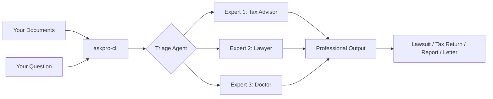
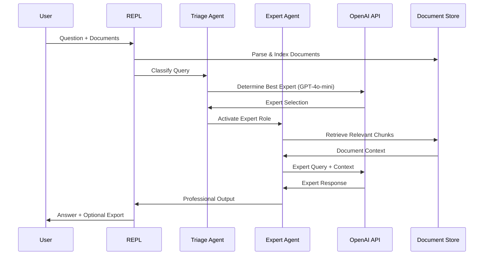
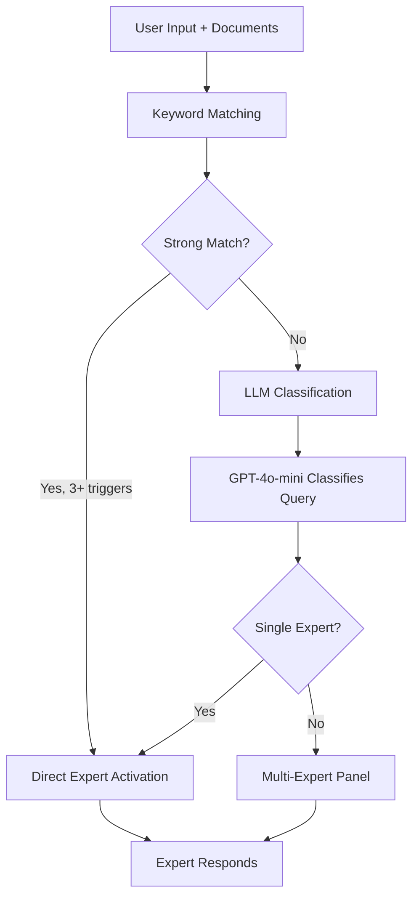
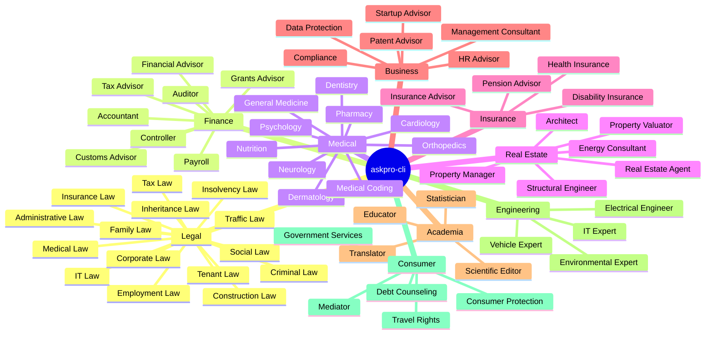
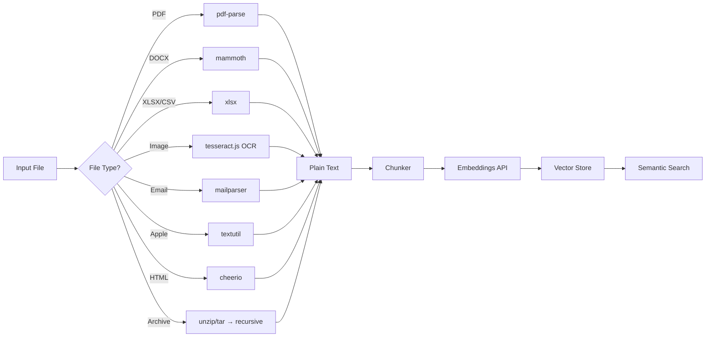

# askpro-cli — User Guide

A free, open-source CLI tool that connects to your OpenAI account and provides expert-level document analysis with 65+ specialist roles.

## Table of Contents

- [Overview](#overview)
- [Installation](#installation)
- [Quick Start](#quick-start)
- [How It Works](#how-it-works)
- [Expert Roles](#expert-roles)
- [Document Formats](#document-formats)
- [Commands](#commands)
- [Configuration](#configuration)
- [Examples](#examples)
- [Platform Support](#platform-support)
- [FAQ](#faq)

---

## Overview

askpro-cli is not a coding assistant. It is a **professional consultation tool** that:

1. Reads documents of any format (PDF, DOCX, images, emails, spreadsheets, etc.)
2. Automatically identifies which expert is needed based on your documents and question
3. Activates the appropriate specialist (lawyer, doctor, tax advisor, architect, etc.)
4. Produces professional outputs (lawsuits, tax declarations, official letters, expert opinions)



## Installation

### Via Homebrew (macOS)

```bash
brew tap marcelrgberger/tap
brew install askpro-cli
```

### Via npm

```bash
npm install -g askpro-cli
```

### From Source

```bash
git clone https://github.com/marcelrgberger/askpro-cli.git
cd askpro-cli
npm install
npm run build
npm link
```

## Quick Start

### 1. Set your OpenAI API Key

```bash
export OPENAI_API_KEY="sk-..."
```

### 2. Start the CLI

```bash
askpro-cli
```

### 3. Ask a question or load documents

```
askpro > Analyze my employment contract for problematic clauses
[Employment Law Attorney activated]
...

askpro > Draft a termination protection lawsuit
[Generating professional document]
...
```

### Non-interactive Mode

```bash
# Analyze a single document
askpro-cli --print "Check this tax assessment for errors" < tax-notice.pdf

# Analyze a directory
askpro-cli --dir ./contracts/ --print "Summarize all contracts"

# Use a specific expert
askpro-cli --role steuerberater --print "Prepare tax return from these receipts"
```

## How It Works



### The Triage System

When you ask a question, the **Triage Agent** determines which expert to activate:



## Expert Roles

### Overview: 65+ Specialists in 9 Categories



### Role Categories

| Category | # Roles | Example Specialists |
|---|---|---|
| **Legal** | 15 | Employment Law, Family Law, Tenant Law, Criminal Law |
| **Finance** | 8 | Tax Advisor, Auditor, Accountant, Controller |
| **Medical** | 10 | Cardiology, Orthopedics, Psychology, Pharmacy |
| **Real Estate** | 6 | Architect, Energy Consultant, Property Manager |
| **Insurance** | 4 | Pension Advisor, Disability Insurance |
| **Business** | 6 | Startup Advisor, Data Protection, Compliance |
| **Academia** | 4 | Scientific Editor, Statistician, Translator |
| **Engineering** | 4 | Vehicle Expert, Environmental Expert |
| **Consumer** | 5 | Consumer Protection, Debt Counseling, Mediator |
| **Meta** | 3 | Triage, Multi-Expert Panel, Quality Assurance |

## Document Formats

askpro-cli reads virtually any document format:

| Category | Formats |
|---|---|
| **Text** | .txt, .md, .rst, .tex, .rtf |
| **Office** | .pdf, .docx, .doc, .xlsx, .xls, .csv, .tsv, .pptx, .ppt |
| **Apple** | .pages, .numbers, .key |
| **Web** | .html, .htm, .xml, .json, .yaml, .yml |
| **Email** | .eml, .msg |
| **Images (OCR)** | .png, .jpg, .jpeg, .tiff, .bmp, .gif, .webp |
| **E-Books** | .epub |
| **Archives** | .zip, .tar.gz, .tar (contents extracted recursively) |

### Document Processing Pipeline



## Commands

| Command | Description |
|---|---|
| `/help` | Show help |
| `/roles` | List all 65+ expert roles |
| `/role <id>` | Manually activate a specific role (e.g., `/role steuerberater`) |
| `/role` | Reset to automatic routing |
| `/model <name>` | Switch model (gpt-4o, gpt-4o-mini, o3, o4-mini) |
| `/model` | Show current model and alternatives |
| `/clear` | Clear conversation |
| `/exit` | Exit |

### CLI Arguments

| Argument | Description |
|---|---|
| `--model, -m` | Model to use (default: gpt-4o) |
| `--role, -r` | Activate specific expert role |
| `--dir, -d` | Directory of documents to ingest on startup |
| `--print, -p` | Non-interactive mode: process query, print result, exit |
| `--api-key` | OpenAI API key |
| `--verbose, -v` | Debug output |

## Configuration

### Global Configuration: `~/.askpro/OPENAI.md`

This file applies to all sessions:

```markdown
# OPENAI.md

## Model
- Default: gpt-4o
- For complex reasoning: o3

## Language
- Output language: German
- Jurisdiction: Germany (DE)

## Preferences
- Always cite legal references
- Highlight deadlines
- When uncertain, state it explicitly
```

### Project Configuration: `./OPENAI.md`

This file applies only in the current directory:

```markdown
# OPENAI.md

## Context
Documents for my 2025 tax return.

## Instructions
- Focus: Income tax, work-related expenses
- Employee, tax class 1
- Home office deduction applicable
```

### Custom Expert Roles

Create custom roles in `~/.askpro/roles/`:

```markdown
---
id: my-expert
name: My Custom Expert
category: custom
triggers:
  - keyword1
  - keyword2
outputs:
  - output-type1
---

# My Custom Expert

## Expertise
Description of expertise...

## Approach
1. Step 1
2. Step 2
```

## Examples

### Example 1: Analyze an Employment Contract

```bash
askpro-cli
> /role fachanwalt-arbeitsrecht
> Read my contract: arbeitsvertrag.pdf
[Reading document...]
> Are there any problematic clauses?
[Analyzing with Employment Law expertise...]
```

### Example 2: Prepare Tax Return

```bash
askpro-cli --dir ./tax-receipts/ --role steuerberater
> Prepare my income tax return from these receipts
[Tax Advisor analyzing 47 documents...]
```

### Example 3: Get a Second Medical Opinion

```bash
askpro-cli
> Read this MRT report: mrt-befund.pdf
[Orthopedics Expert activated]
> What does this mean in plain language? What are my treatment options?
```

### Example 4: Multi-Expert Panel for Divorce

```bash
askpro-cli --dir ./scheidung/
> I need advice on my divorce — consider legal, financial, and property aspects
[Multi-Expert Panel: Family Law + Tax Advisor + Property Valuator]
```

### Example 5: Draft Official Letter

```bash
askpro-cli
> My landlord is increasing rent by 20%. Write an objection letter.
[Tenant Law Expert activated → Professional objection letter generated]
> /export md
[Exported: widerspruch-mieterhoehung-2026-03-27.md]
```

## Platform Support

**askpro-cli is currently optimized for macOS.** Apple document formats (.pages, .numbers, .key) use macOS-native tools (`textutil`).

**Contributions for Windows and Linux are very welcome!** If you'd like to port askpro-cli to other platforms, we appreciate pull requests.

## FAQ

**Q: Is this a coding assistant?**
A: No. askpro-cli is specialized for document analysis and professional consultation. For coding, use Claude Code or similar tools.

**Q: Is this free?**
A: The software is free and open source (MIT License). You need your own OpenAI API key — API usage costs apply according to OpenAI's pricing.

**Q: Can I use my own expert roles?**
A: Yes! Place `.md` files in `~/.askpro/roles/` with the proper YAML frontmatter.

**Q: Which OpenAI models are supported?**
A: GPT-4o, GPT-4o-mini, o3, and o4-mini. Default is GPT-4o.

**Q: Is my data secure?**
A: Documents are parsed locally. Only text chunks (not full documents) are sent to OpenAI for analysis. No data is stored on external servers.

**Q: Can this replace a real lawyer/doctor/tax advisor?**
A: No. askpro-cli provides AI-assisted analysis and drafts. For legally binding actions, always consult a licensed professional.

---

## Important Disclaimer

> This software provides AI-assisted analysis and drafts. It does **not** replace professional consultation by licensed lawyers, doctors, tax advisors, or other specialists. All information is provided without warranty. For legally binding actions, always consult a licensed professional.
